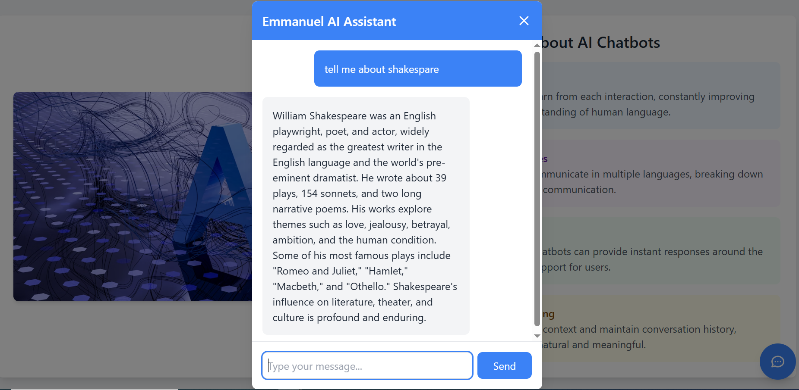

# AI Chatbot with Modern UI

A sophisticated AI chatbot application featuring a modern, responsive user interface with real-time chat capabilities powered by OpenAI's GPT model.


## ✨ Features

- **Modern UI Design**
  - Clean, responsive layout
  - Floating chat interface
  - Smooth animations and transitions
  - Professional color scheme

- **AI Chat Capabilities**
  - Real-time chat with OpenAI GPT
  - Message history tracking
  - Error handling and loading states
  - Contextual understanding

- **Interactive Elements**
  - Image gallery with hover effects
  - Informative AI facts section
  - Responsive design for all devices
  - Accessible UI components

## 🚀 Getting Started

### Prerequisites

- Node.js (v14 or higher)
- npm or yarn
- OpenAI API key

### Installation

1. Clone the repository:
```bash
git clone https://github.com/yourusername/ai-chatbot.git
cd ai-chatbot
```

2. Install dependencies:
```bash
# Install backend dependencies
cd backend
npm install

# Install frontend dependencies
cd ../frontend
npm install
```

3. Set up environment variables:
   - Create a `.env` file in the backend directory
   - Add your OpenAI API key:
   ```
   OPENAI_API_KEY=your_api_key_here
   ```

### Running the Application

1. Start the backend server:
```bash
cd backend
npm run server
```

2. Start the frontend development server:
```bash
cd frontend
npm start
```

The application will be available at `http://localhost:3000`

## 🖼️ Interface Preview

### Chat Interface


The chat interface features:
- Floating chat button for easy access
- Modal chat window with message history
- Real-time message updates
- Loading indicators
- Error handling

### Main Interface


The main interface includes:
- AI technology showcase
- Informative facts section
- Image gallery
- Responsive layout

## 🛠️ Technologies Used

- **Frontend**
  - React.js
  - TypeScript
  - Tailwind CSS
  - Axios

- **Backend**
  - Node.js
  - Express
  - OpenAI API

## 📝 License

This project is licensed under the MIT License - see the [LICENSE](LICENSE) file for details.

## 🤝 Contributing

Contributions are welcome! Please feel free to submit a Pull Request.

## 📫 Contact

For any questions or suggestions, please open an issue or contact the maintainers.

---

Made with ❤️ by [Emmanuel Okelue] 